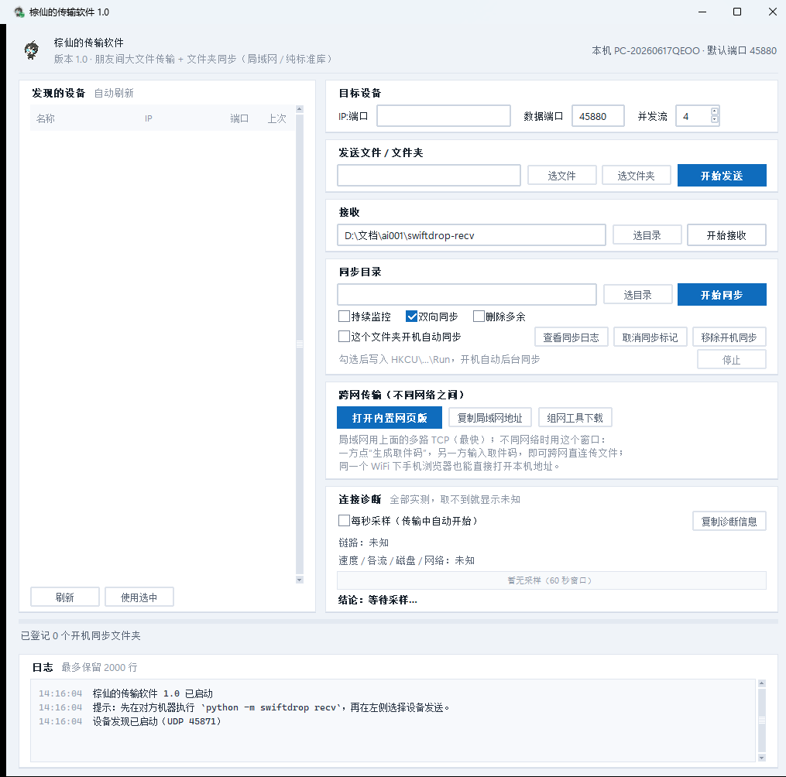

# Zongxian Transfer

A tool for transferring large files between friends: **no server installation, no public IP required, unlimited speed, and ad-free**.
Choose from three forms: **Single-file web app** (just send the HTML to friends to double-click and use), **Windows desktop app** (fastest on LAN + folder sync), and **Mobile browser** (use directly on the same WiFi or virtual LAN).

> The name comes from the author's character "Zongxian". The icon/character image belongs to the author.
> **This is an open-source project welcoming improvements** — if you want to participate, please see [CONTRIBUTING.md](CONTRIBUTING.md) (which lists the most needed areas for help).

[中文版 (Chinese Version)](README.md)

---

## Features

| Scenario | How to use | Measured Speed |
|---|---|---|
| Two PCs on the same WiFi | Desktop app `send` / `recv`, or UI | **150+ MB/s** (multi-stream TCP) |
| PC ↔ Phone (same WiFi) | PC runs `webapp`, phone scans QR to open | Limited by WiFi, usually 5~20 MB/s |
| Remote (different city/network) | See "Remote Transfer" section below | 2~10 MB/s (**max = sender's upload bandwidth**) |
| Auto Folder Sync | Desktop app "Sync Dir" + optional autostart | Full LAN speed |
| Huge files / Network drops | Auto **resume from break** (4MB chunk + SHA-256) | — |

Speed reference (tested locally, not promotional numbers): Desktop app 200MB 4 streams **~150 MB/s**; Browser P2P loopback **~27 MB/s**; 400 small files **~3 s**.

---

## Screenshots

| Web App (Light) | Web App (Dark, Connected + Transferring + Diagnostics) |
|---|---|
|  |  |



---

## Quick Start

### 1) Web App (Zero installation, best for friends)
Send `swiftdrop.html` to the other party via messenger, both **double-click to open**, then:
- One side clicks "Generate Code" → send the 9-digit code to the other party;
- The other side **enters this 9-digit code** in "I want to receive" and clicks "Connect".

> Note: When opened via `file://`, the "link/QR code" in the page points to your own hard drive and is invalid for others—
> So **what you must send is the 9-digit code** (or have the other party open the same html). The page will automatically detect this and prompt you.

### 2) Windows Desktop App
Download `棕仙的传输软件-自解压版.exe` from Release (double click → choose dir → extract and use), or `zongxian-portable-win64.zip` (double click exe after extracting).

```
棕仙的传输软件.exe peers                     # Discover LAN devices
棕仙的传输软件.exe recv --dir D:\Receive       # Receiver
棕仙的传输软件.exe send <DeviceName or IP> <File> # Sender (--streams 6 to improve cross-network throughput)
棕仙的传输软件.exe sync <DeviceName or IP> D:\SyncDir --watch
棕仙的传输软件.exe webapp                     # Cross-network transfer: open built-in web app
棕仙的传输软件.exe group                      # View remote virtual LAN address
```

### 3) Mobile Phone
- **Same WiFi**: PC runs `webapp`, the interface provides the LAN address and QR code, phone scans it.
- **Remote**: See below.

---

## Remote Transfer (Important, read this first)

**Physical fact**: When both parties are behind Carrier-Grade NAT (CGNAT), **no software can connect directly out of thin air**—a third party must broker the connection.
Therefore, the strategy of this project is:

1. **Preferred: Install a free virtual LAN tool** to put both devices in the same virtual LAN, then this software will use the LAN multi-stream TCP direct transfer
   (**No hole punching needed, no public IP needed, no relay server needed**, 100% success rate):
   - [Tailscale](https://tailscale.com/download) — Cross-platform, WireGuard direct connection, choose this when a phone is involved;
   - [Radmin VPN](https://www.radmin-vpn.com/cn/) — Windows only, fast domestically, extremely simple configuration;
   - [ZeroTier](https://www.zerotier.com/download/) — Cross-platform, requires Network ID.

   After installing, run `棕仙的传输软件.exe group` to see the virtual LAN address; give it to the other party (or click "Copy LAN address" / check the QR code in the built-in web app).

2. **Alternative**: Phone shares hotspot for PC to connect (instantly becomes a LAN).
3. **The Web App also built-in public signaling + NAT hole punching** (WebRTC): Can connect directly if one side is Full Cone NAT; if both are CGNAT, it fails to connect and gives prompts and solutions directly on the interface.

⚠️ **The upper limit of remote speed is always "the sender's upload bandwidth"**, virtual LAN only solves "can connect, stable, fills the pipe":

| Sender | Realistic Rate |
|---|---|
| Home broadband upload 100 Mbps | ~10 MB/s |
| Home broadband upload 20~30 Mbps (common) | 2~4 MB/s |
| Mobile 4G/5G | 0.5~2.5 MB/s |
| Browser WebRTC single stream (lossy link) | Tested 30~60 KB/s |

The program will **automatically increase concurrent streams based on connection latency to target** (4 streams for LAN, up to 8 for cross-network) to max out bandwidth.

---

## Run from Source / Build

Only depends on **Python 3.10+ standard library** (desktop/server), web app is a single HTML file, no CDN/third-party JS.

```bash
# Run desktop app (from source)
set PYTHONPATH=src
python -m swiftdrop gui          # GUI
python -m swiftdrop group        # Remote virtual LAN address
python -m swiftdrop webhost      # LAN static server + /signal signaling relay
python -m swiftdrop webapp       # Cross-network transfer: built-in web app window

# Build web app single file (inline js/css into dist/swiftdrop.html)
python build/build-web.py

# Run tests
python build/verify-desktop.py   # Desktop end-to-end 5/5
python tests/test_lan.py         # LAN/relay/webhost 6 items
python build/verify-diag.py      # Connection diagnostics panel test

# Build Windows package (requires PyInstaller; see build/)
python build/build-exe.py        # Generate dist/ and portable zip
python build/make-sfx.py         # Self-extracting exe (NSIS)
python build/make-installer.py   # Traditional installer (NSIS)
```

Web app browser E2E test (Playwright + local Edge):

```bash
node build/e2e/e2e.mjs           # 8/8 items
node build/e2e/lan-e2e.mjs       # Pure LAN signaling + diagnostics panel
```

---

## Directory Structure

```
src/web/           Web app (source of single-file HTML)
src/swiftdrop/     Desktop app & Server (pure standard lib)
  ├─ transfer.py   LAN multi-stream TCP engine
  ├─ discovery.py  UDP broadcast discovery
  ├─ sync.py       3-way state folder sync
  ├─ webhost.py    LAN static server + /signal signaling relay
  ├─ netgroup.py   Remote virtual LAN interface recognition
  ├─ webview.py    Open built-in web app using system Edge/Chrome
  ├─ cli.py gui.py CLI and GUI
  └─ foldericon.py Auto change sync folder icon, autostart.py
src/relay/         Optional relay server (fallback for hole punching failure)
build/             Build scripts, e2e tests
tests/             Unit and e2e tests
```

---

## Technical Highlights

- **Transfer**: LAN uses N parallel TCP streams, 8MB fragments, 4MB block SHA-256 validation, only filling missing blocks (resume).
- **Web App P2P**: Built-in minimalist MQTT 3.1.1 over WebSocket client, WebRTC data channel transfer, DTLS end-to-end encryption.
- **Performance Tuning**: Send buffer limit 12MB, backpressure wait 15ms limit, receiver fsyncs only once at file end.
- **Diagnostics**: Panel uses true values from `getStats()` to conclude "where the bottleneck is".

---

## Known Limitations

- **Pure P2P fails when both are CGNAT**: Physical limitation, not a bug. Use virtual LAN tools, hotspots, or self-hosted relay.
- **Remote speed limited by sender's upload**.
- **Android client deprecated**: Hard to maintain. Use browser on mobile.
- Relay server (`src/relay/`) requires you to provide a public IP machine.
- Currently only packaged and tested on Windows (Desktop code is cross-platform stdlib, but unverified on macOS/Linux).

---

## Contribute

**Any help is useful**: report bugs, request features, fix docs, code, translate.

- **To code**: See [CONTRIBUTING.md](CONTRIBUTING.md).
- **To report bugs**: Open an Issue and attach **the full text from "Copy diagnostic info"** in the Diagnostics panel.
- **Before submitting**, at least pass: `python build/verify-desktop.py` (5/5), `node build/e2e/e2e.mjs` (8/8).

## License

- **Code**: MIT License (see [LICENSE](LICENSE))
- **Artwork**: "Zongxian" character and icons are author's work, **NOT under MIT**, no commercial use without permission; please replace icons if forking for personal use.
